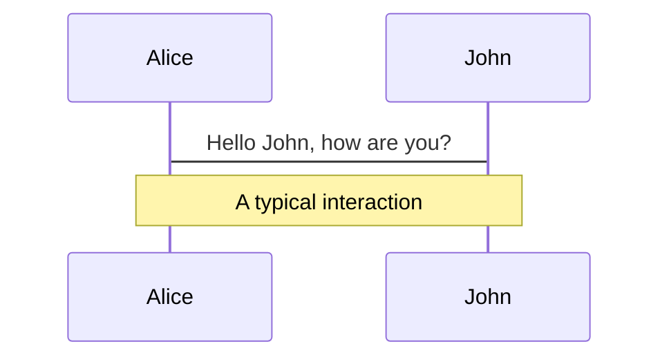
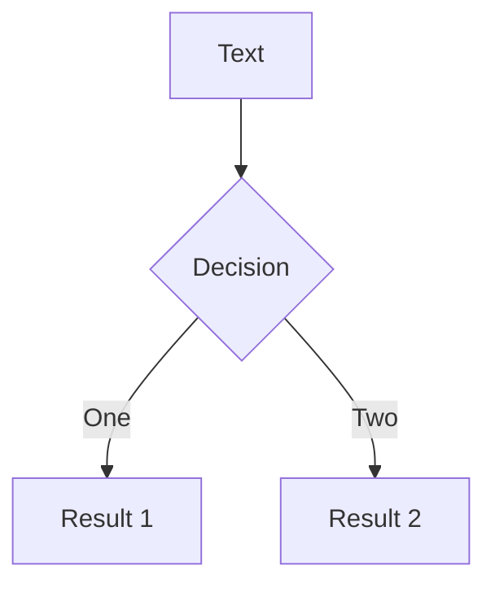
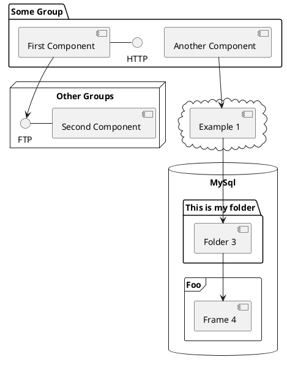

---
# You can also start simply with 'default'

theme: seriph

# random image from a curated Unsplash collection by Anthony

# like them? see https://unsplash.com/collections/94734566/slidev

background: https://cover.sli.dev

# some information about your slides (markdown enabled)

title: Welcome to Slidev

info: |

  ## Slidev Starter Template

  Presentation slides for developers.


  Learn more at [Sli.dev](https://sli.dev)

# apply unocss classes to the current slide

class: text-center

# https://sli.dev/features/drawing

drawings:

  persist: false

# slide transition: https://sli.dev/guide/animations.html#slide-transitions

transition: slide-left

# enable MDC Syntax: https://sli.dev/features/mdc

mdc: true
---
# Welcome to Slidev

Presentation slides for developers

<div @click="$slidev.nav.next"class="mt-12 py-1"hover:bg="white op-10">

  Press Space for next page <carbon:arrow-right />

</div>

<divclass="abs-br m-6 text-xl">

  <button @click="$slidev.nav.openInEditor"title="Open in Editor"class="slidev-icon-btn">

    <carbon:edit />

</button>

  [ahref=&#34;https://github.com/slidevjs/slidev&#34;target=&#34;_blank&#34;class=&#34;slidev-icon-btn&#34;](ahref=%22https://github.com/slidevjs/slidev%22target=%22_blank%22class=%22slidev-icon-btn%22)

    <carbon:logo-github />

</a>

</div>

<!--

The last comment block of each slide will be treated as slide notes. It will be visible and editable in Presenter Mode along with the slide. [Read more in the docs](https://sli.dev/guide/syntax.html#notes)

-->

---

transition: fade-out

---

# What is Slidev?

Slidev is a slides maker and presenter designed for developers, consist of the following features

- 📝 **Text-based** - focus on the content with Markdown, and then style them later
- 🎨 **Themable** - themes can be shared and re-used as npm packages
- 🧑‍💻 **Developer Friendly** - code highlighting, live coding with autocompletion
- 🤹 **Interactive** - embed Vue components to enhance your expressions
- 🎥 **Recording** - built-in recording and camera view
- 📤 **Portable** - export to PDF, PPTX, PNGs, or even a hostable SPA
- 🛠 **Hackable** - virtually anything that's possible on a webpage is possible in Slidev

<br>

<br>

Read more about [Why Slidev?](https://sli.dev/guide/why)

<!--

You can have `style` tag in markdown to override the style for the current page.

Learn more: https://sli.dev/features/slide-scope-style

-->

<style>

h1 {

  background-color: #2B90B6;

  background-image: linear-gradient(45deg, #4EC5D410%, #146b8c20%);

  background-size: 100%;

  -webkit-background-clip: text;

  -moz-background-clip: text;

  -webkit-text-fill-color: transparent;

  -moz-text-fill-color: transparent;

}

</style>

<!--

Here is another comment.

-->

---

transition: slide-up

level: 2

---

# Navigation

Hover on the bottom-left corner to see the navigation's controls panel, [learn more](https://sli.dev/guide/ui#navigation-bar)

## Keyboard Shortcuts

|                                                     |                             |

| --------------------------------------------------- | --------------------------- |

| `<kbd>`right`</kbd>` / `<kbd>`space`</kbd>`                 | next animation or slide     |

| `<kbd>`left`</kbd>`  / `<kbd>`shift`</kbd><kbd>`space`</kbd>` | previous animation or slide |

| `<kbd>`up`</kbd>`                                       | previous slide              |

| `<kbd>`down`</kbd>`                                     | next slide                  |

<!-- https://sli.dev/guide/animations.html#click-animation -->


<pv-afterclass="absolute bottom-23 left-45 opacity-30 transform -rotate-10">Here!`</p>`

---

layout: two-cols

layoutClass: gap-16

---

# Table of contents

You can use the `Toc` component to generate a table of contents for your slides:

```html

<TocminDepth="1"maxDepth="1" />

```

The title will be inferred from your slide content, or you can override it with `title` and `level` in your frontmatter.

::right::

<Toctext-smminDepth="1"maxDepth="2" />

---

layout: image-right

image: https://cover.sli.dev

---

# Code

Use code snippets and get the highlighting directly, and even types hover!

```ts

// TwoSlash enables TypeScript hover information

// and errors in markdown code blocks

// More at https://shiki.style/packages/twoslash


import { computed, ref } from'vue'


constcount=ref(0)

constdoubled=computed(() => count.value *2)


doubled.value =2


a

```

<arrowv-click="[4, 5]"x1="350"y1="310"x2="195"y2="334"color="#953"width="2"arrowSize="1" />

<!-- This allow you to embed external code blocks -->

<<< @/snippets/external.ts#snippet

<!-- Footer -->

[Learn more](https://sli.dev/features/line-highlighting)

<!-- Inline style -->

<style>

.footnotes-sep {

  @applymt-5opacity-10;

}

.footnotes {

  @applytext-smopacity-75;

}

.footnote-backref {

  display: none;

}

</style>

<!--

Notes can also sync with clicks


[click] This will be highlighted after the first click


[click] Highlighted with `count = ref(0)`


[click:3] Last click (skip two clicks)

-->

---

level: 2

---

# Shiki Magic Move

Powered by [shiki-magic-move](https://shiki-magic-move.netlify.app/), Slidev supports animations across multiple code snippets.

Add multiple code blocks and wrap them with `<code>`````md magic-move`</code>` (four backticks) to enable the magic move. For example:

````md

```ts {*|2|*}

// step 1

constauthor=reactive({

  name: 'John Doe',

  books: [

    'Vue 2 - Advanced Guide',

    'Vue 3 - Basic Guide',

    'Vue 4 - The Mystery'

  ]

})

```


```ts {*|1-2|3-4|3-4,8}

// step 2

exportdefault {

  data() {

    return {

      author: {

        name: 'John Doe',

        books: [

          'Vue 2 - Advanced Guide',

          'Vue 3 - Basic Guide',

          'Vue 4 - The Mystery'

        ]

      }

    }

  }

}

```


```ts

// step 3

exportdefault {

  data: () => ({

    author: {

      name: 'John Doe',

      books: [

        'Vue 2 - Advanced Guide',

        'Vue 3 - Basic Guide',

        'Vue 4 - The Mystery'

      ]

    }

  })

}

```


Non-code blocks are ignored.


```vue

<!-- step 4 -->

<scriptsetup>

constauthor= {

  name: 'John Doe',

  books: [

    'Vue 2 - Advanced Guide',

    'Vue 3 - Basic Guide',

    'Vue 4 - The Mystery'

  ]

}

</script>

```

````

---

# Components

<divgrid="~ cols-2 gap-4">

<div>

You can use Vue components directly inside your slides.

We have provided a few built-in components like `<Tweet/>` and `<Youtube/>` that you can use directly. And adding your custom components is also super easy.

```html

<Counter :count="10" />

```

<!-- ./components/Counter.vue -->

<Counter :count="10"m="t-4" />

Check out [the guides](https://sli.dev/builtin/components.html) for more.

</div>

<div>

```html

<Tweetid="1390115482657726468" />

```

<Tweetid="1390115482657726468"scale="0.65" />

</div>

</div>

<!--

Presenter note with **bold**, *italic*, and ~~striked~~ text.


Also, HTML elements are valid:

<div class="flex w-full">

  <span style="flex-grow: 1;">Left content</span>

  <span>Right content</span>

</div>

-->

---

class: px-20

---

# Themes

Slidev comes with powerful theming support. Themes can provide styles, layouts, components, or even configurations for tools. Switching between themes by just **one edit** in your frontmatter:

<divgrid="~ cols-2 gap-2"m="t-2">

```yaml

---

theme: default

---

```

```yaml

---

theme: seriph

---

```

[imgborder=&#34;rounded&#34;src=&#34;https://github.com/slidevjs/themes/blob/main/screenshots/theme-default/01.png?raw=true&#34;alt=&#34;&#34;](imgborder=%22rounded%22src=%22https://github.com/slidevjs/themes/blob/main/screenshots/theme-default/01.png?raw=true%22alt=%22%22)

[imgborder=&#34;rounded&#34;src=&#34;https://github.com/slidevjs/themes/blob/main/screenshots/theme-seriph/01.png?raw=true&#34;alt=&#34;&#34;](imgborder=%22rounded%22src=%22https://github.com/slidevjs/themes/blob/main/screenshots/theme-seriph/01.png?raw=true%22alt=%22%22)

</div>

Read more about [How to use a theme](https://sli.dev/guide/theme-addon#use-theme) and

check out the [Awesome Themes Gallery](https://sli.dev/resources/theme-gallery).

---

# Clicks Animations

You can add `v-click` to elements to add a click animation.

<divv-click>

This shows up when you click the slide:

```html

<divv-click>This shows up when you click the slide.</div>

```

</div>

<br>

<v-click>

The <spanv-mark.red="3">`<code>`v-mark`</code>` directive

also allows you to add

<spanv-mark.circle.orange="4">inline marks

, powered by [Rough Notation](https://roughnotation.com/):

```html

<spanv-mark.underline.orange>inline markers</span>

```

</v-click>

<divmt-20v-click>

[Learn more](https://sli.dev/guide/animations#click-animation)

</div>

---

# Motions

Motion animations are powered by [@vueuse/motion](https://motion.vueuse.org/), triggered by `v-motion` directive.

```html

<div

  v-motion

  :initial="{ x: -80 }"

  :enter="{ x: 0 }"

  :click-3="{ x: 80 }"

  :leave="{ x: 1000 }"

>

  Slidev

</div>

```

<divclass="w-60 relative">

  <divclass="relative w-40 h-40">

    

    

    

</div>

<div

    class="text-5xl absolute top-14 left-40 text-[#2B90B6] -z-1"

    v-motion

    :initial="{ x: -80, opacity: 0}"

    :enter="{ x: 0, opacity: 1, transition: { delay: 2000, duration: 1000 } }">

    Slidev

</div>

</div>

<!-- vue script setup scripts can be directly used in markdown, and will only affects current page -->

<scriptsetuplang="ts">

constfinal= {

  x: 0,

  y: 0,

  rotate: 0,

  scale: 1,

  transition: {

    type: 'spring',

    damping: 10,

    stiffness: 20,

    mass: 2

  }

}

</script>

<div

  v-motion

  :initial="{ x:35, y: 30, opacity: 0}"

  :enter="{ y: 0, opacity: 1, transition: { delay: 3500 } }">

[Learn more](https://sli.dev/guide/animations.html#motion)

</div>

---

# LaTeX

LaTeX is supported out-of-box. Powered by [KaTeX](https://katex.org/).

<divh-3/>

Inline $\sqrt{3x-1}+(1+x)^2$

Block

$$
{1|3|all}

\begin{aligned}

\nabla\cdot\vec{E} &= \frac{\rho}{\varepsilon_0} \\

\nabla\cdot\vec{B} &= 0 \\

\nabla\times\vec{E} &= -\frac{\partial\vec{B}}{\partial t} \\

\nabla\times\vec{B} &= \mu_0\vec{J} + \mu_0\varepsilon_0\frac{\partial\vec{E}}{\partial t}

\end{aligned}
$$

[Learn more](https://sli.dev/features/latex)

---

# Diagrams

You can create diagrams / graphs from textual descriptions, directly in your Markdown.

<divclass="grid grid-cols-4 gap-5 pt-4 -mb-6">





```mermaid

mindmap

  root((mindmap))

    Origins

      Long history

      ::icon(fa fa-book)

      Popularisation

        British popular psychology author Tony Buzan

    Research

      On effectiveness<br/>and features

      On Automatic creation

        Uses

            Creative techniques

            Strategic planning

            Argument mapping

    Tools

      Pen and paper

      Mermaid

```



</div>

Learn more: [Mermaid Diagrams](https://sli.dev/features/mermaid) and [PlantUML Diagrams](https://sli.dev/features/plantuml)

---

foo: bar

dragPos:

  square: 691,32,167,_,-16

---

# Draggable Elements

Double-click on the draggable elements to edit their positions.

<br>

###### Directive Usage

```md

<imgv-drag="'square'"src="https://sli.dev/logo.png">

```

<br>

###### Component Usage

```md

<v-dragtext-3xl>

  <divclass="i-carbon:arrow-up"/>

  Use the `v-drag` component to have a draggable container!

</v-drag>

```

<v-dragpos="663,206,261,_,-15">

<divtext-centertext-3xlborderborder-mainrounded>

    Double-click me!

</div>

</v-drag>

[imgv-drag=&#34;&#39;square&#39;&#34;src=&#34;https://sli.dev/logo.png&#34;](imgv-drag=%22'square'%22src=%22https://sli.dev/logo.png%22)

###### Draggable Arrow

```md

<v-drag-arrowtwo-way />

```

<v-drag-arrowpos="67,452,253,46"two-wayop70 />

---

src: ./pages/imported-slides.md

hide: false

---

---

# Monaco Editor

Slidev provides built-in Monaco Editor support.

Add `{monaco}` to the code block to turn it into an editor:

```ts

import { ref } from'vue'

import { emptyArray } from'./external'


constarr=ref(emptyArray(10))

```

Use `{monaco-run}` to create an editor that can execute the code directly in the slide:

```ts

import { version } from'vue'

import { emptyArray, sayHello } from'./external'


sayHello()

console.log(`vue ${version}`)

console.log(emptyArray<number>(10).reduce(fib=> [...fib, fib.at(-1)!+ fib.at(-2)!], [1, 1]))

```

---

layout: center

class: text-center

---

# Learn More

[Documentation](https://sli.dev) · [GitHub](https://github.com/slidevjs/slidev) · [Showcases](https://sli.dev/resources/showcases)

<PoweredBySlidevmt-10 />
